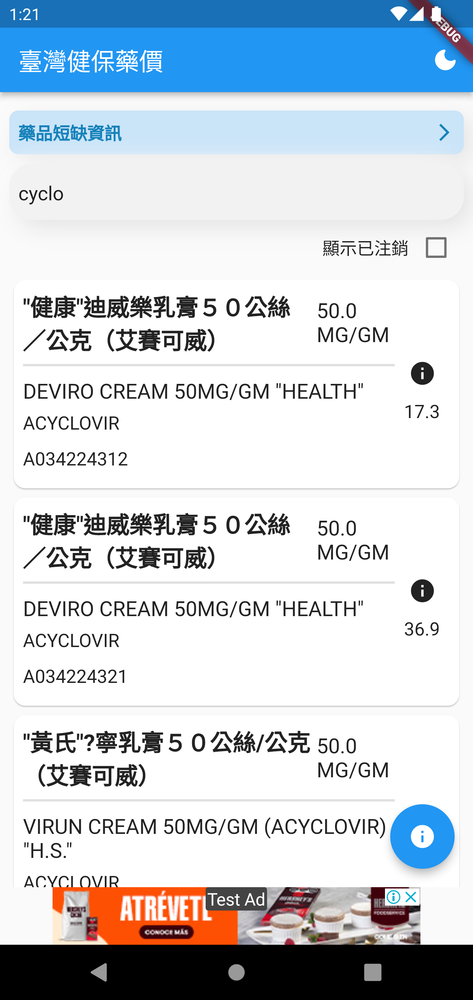
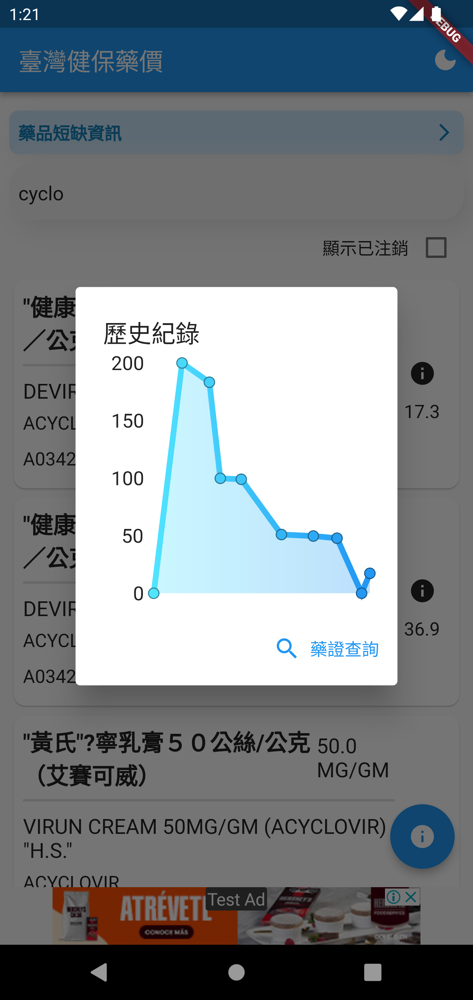
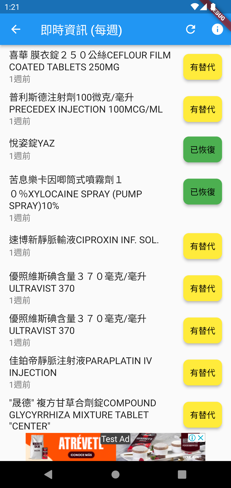
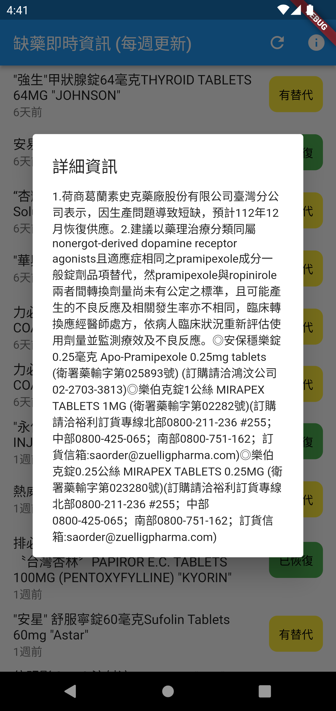
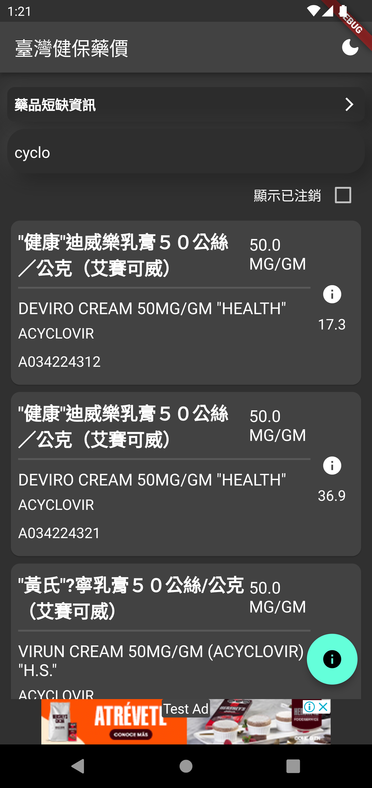

# 臺灣健保藥價

將健保藥品給付資訊以手機App呈現

提供簡易查詢、價格走勢、許可證內容查詢、藥品供應資訊等功能

## 螢幕截圖
<table>
  <tr>
    <td></td>
    <td></td>
    <td></td>
  </tr>
</table>
<table>
  <tr>
    <td></td>
    <td></td>
  </tr>
</table>

## 技術採用
- Flutter
- Bloc
- Isolate
- HTML parse
- third party packages:
  - archive (解壓縮)
  - shared_preferences (本地快取儲存)
  - drift (本地SQLite儲存)
  - fl_chart (價格圖表呈現)
  - url_launcher (網頁跳轉)
